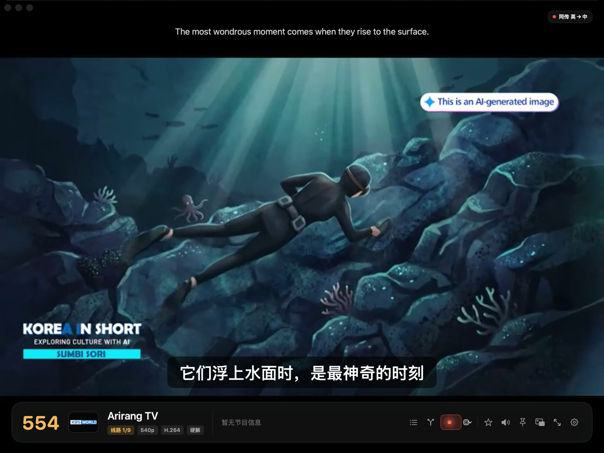
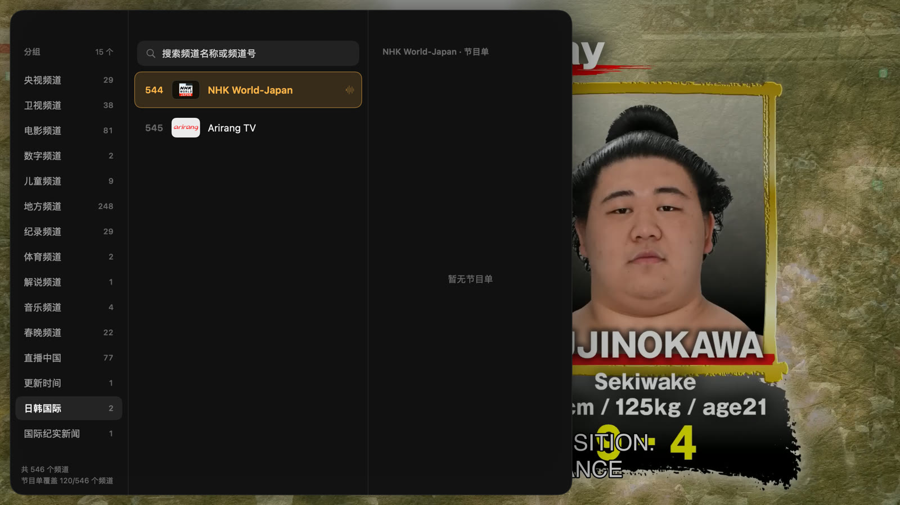
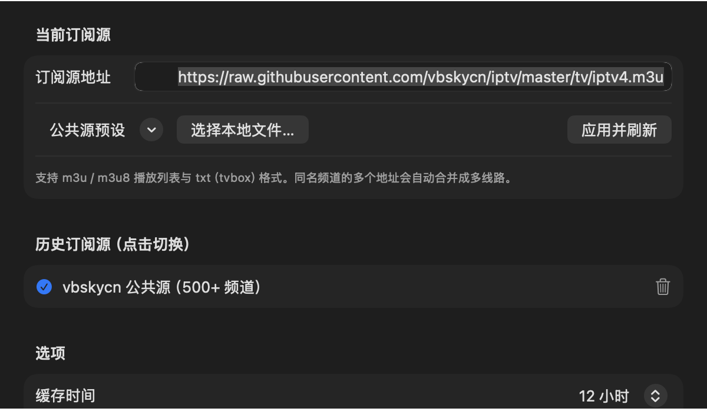
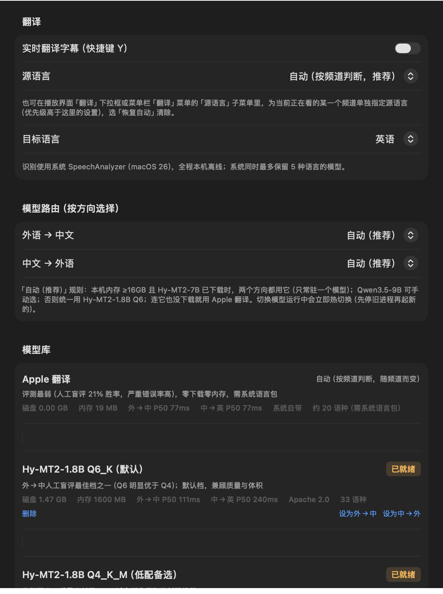

<div align="center">


# 我的电视

**给 Mac 装个能看电视的软件。IPTV 播放器 + 本地 AI 实时字幕翻译，全部离线跑在你自己的 Mac 上。**

[](#系统要求)
[](#系统要求)
[](#技术栈)
[](#说明)
[](https://github.com/kanekanefy/mytv-for-mac/releases/latest)

[功能](#功能) · [截图](#截图) · [安装](#安装) · [首次配置](#首次配置订阅源) · [FAQ](#faq) · [隐私](#隐私) · [路线图](#路线图)

</div>

---

## 说明

这是一个私人项目的**发布仓库**：只放安装包、文档和截图，**不包含源代码**。如果你是被作者直接分享这个仓库链接的朋友，跳到 [安装](#安装) 就够了。

## 功能

| 分类 | 能力 |
|---|---|
| 直播源 | 支持 m3u / m3u8 / txt（tvbox 格式）订阅源，同名频道多线路自动合并，内置公共源一键切换 |
| EPG 节目单 | 自动抓取显示当前/下一节目，带进度条 |
| 播放 | libmpv 硬解（VideoToolbox），1080i 自动去隔行，画面比例锁定/自动拉伸切换 |
| 台标 | 频道台标自动匹配显示 |
| 实时翻译字幕（本地 AI） | 外语直播 → 中文字幕，全程本机推理，不联网、不上传音频 |
| 同传模式 | 画面自动延后几秒对齐字幕，退出同传时有过场动画不生硬跳变 |
| 双语字幕 | 原文 + 译文同屏，两种排布可选 |
| 按频道自动语种 | 不用手动选语言，看哪个台自动判断说的是什么语言 |
| 模型对比 / 盲评 | 两个翻译模型同屏对比，盲评投票积累数据 |
| 外语台（可选） | 内置一份 iptv-org 公开外语纪实频道列表，默认关闭，设置页一键开 |

## 截图

<p align="center"><br/><sub>实时同传（英 → 中）：本机模型翻译，字幕与口型同步，右上角「同传」指示灯</sub></p>

<table>
<tr>
<td width="50%"><br/><sub>双语叠放（中 → 英）：译文为主、原文为辅</sub></td>
<td width="50%"><br/><sub>双语原文置顶：原文放画面上方，自动避开台标与硬字幕</sub></td>
</tr>
<tr>
<td width="50%"><br/><sub>模型对比：两个翻译模型同屏，可开盲评投票</sub></td>
<td width="50%"><br/><sub>频道列表：分组、台标、搜索、节目单</sub></td>
</tr>
<tr>
<td width="50%"><br/><sub>订阅源：内置公共源，也可添加自己的地址</sub></td>
<td width="50%"><br/><sub>翻译模型库：按方向自动推荐，App 内一键下载</sub></td>
</tr>
</table>

> 截图使用的是内置公共订阅源（vbskycn 500+ 频道），不包含任何私人频道配置。

## 系统要求

- macOS 26 及以上
- Apple 芯片（M 系列）；不支持 Intel Mac
- 约 100MB 磁盘空间（App 本体），实时翻译功能首次使用时另需下载模型（见下）

## 安装

1. 在本仓库的 [Releases](../../releases) 页面下载最新的 `MyTV-for-Mac-x.x.x.dmg`
2. 打开 DMG，把「我的电视」拖进 Applications
3. **第一次打开会被系统拦住**（这个 App 没有付费的 Apple 开发者证书公证，Gatekeeper 默认不认识它），按下面任一方法放行：
   - **右键点击** App → 选择「打开」→ 弹窗里再点一次「打开」
   - 或者：打开「系统设置」→「隐私与安全性」，往下翻到提示「我的电视」被阻止的那一行，点「仍要打开」
   - 如果两个方法都不出现选项，在终端执行一次：
     ```bash
     xattr -dr com.apple.quarantine "/Applications/我的电视.app"
     ```
4. 之后正常双击打开就行，只有第一次需要这么做

## 首次配置订阅源

App 内置了一个公共 IPTV 源（500+ 频道），**第一次打开就能直接看**，不需要任何配置。

如果朋友给了你自己的订阅源地址，打开「我的电视」→ 菜单栏「我的电视」→「设置…」→「订阅源」标签页，粘贴地址后点「应用并刷新」即可。

想看 BBC Earth / 国家地理这类国际纪实频道：设置 →「订阅源」→ 找到「国际纪实 / 外语台」那一条附加源，打开开关（默认是关闭的）。这些是 [iptv-org](https://github.com/iptv-org/iptv) 上的公开流。

## 实时翻译字幕怎么用

1. 播放任意频道时按 `Y`，或菜单栏「翻译」→「开启实时翻译字幕」
2. **第一次用会提示下载模型**（默认档位约 1.5GB，纯本地 GGUF 模型，不是云端 API）——设置页「翻译」标签能看到模型库，选一个点下载，国内网络优先走魔搭（ModelScope）源，速度更快
3. 下载完自动加载，几秒内出字幕；源语言按频道自动判断，也可以手动指定
4. 全程本机推理（llama-server 子进程 + Metal 加速），不联网、不上传音频、不依赖任何云端 API

## FAQ

**为什么第一次打开提示"无法打开，因为无法验证开发者"？**
见上面「安装」第 3 步，右键打开或去系统设置里放行一次就行，这是正常现象（个人开发者没有花钱买 Apple 的公证服务）。

**翻译功能用不了 / 提示找不到 llama-server？**
App 已经把本地推理运行时打包在里面了，正常情况不需要额外安装任何东西。如果确实报错，请反馈问题时附上「设置 → 调试」页面的日志路径内容。

**会不会偷偷联网上传我的数据？**
不会。翻译识别、断句、模型推理全部在本机跑；唯一联网的地方是拉取你自己配置的 IPTV/EPG 地址，以及首次下载翻译模型。见下面「隐私」。

**能不能在 Intel Mac / macOS 25 及更早版本上跑？**
不能。用到了 macOS 26 才有的 API（系统级 SpeechAnalyzer 语音识别等），也只编译了 Apple 芯片版本。

**为什么图标/名字看起来像"XX 电视"某个安卓项目？**
这是作者用 Swift + SwiftUI + libmpv 从零重写的 macOS 原生版，功能定位上参考了 [yaoxieyoulei/mytv-android](https://github.com/yaoxieyoulei/mytv-android)（MIT 协议）这个安卓开源项目，但代码是独立实现，不是移植代码。

## 隐私

- **翻译功能完全在本机运行**：语音识别（系统 SpeechAnalyzer）+ 文本翻译（本机 GGUF 模型，通过 llama-server 子进程推理）全程离线，不上传音频、不上传字幕内容、不依赖任何云端翻译 API（除非你自己在设置里手动填了一个第三方 OpenAI 兼容接口地址）
- **不收集任何使用数据/遥测到作者服务器**：本地会写调试日志（路径见设置页），只留在你自己的电脑上
- App 本身不包含任何人的私人 IPTV 订阅地址——你需要自己配置，或使用内置的公共源

## 致谢与第三方组件

看 [THIRD_PARTY_NOTICES.md](THIRD_PARTY_NOTICES.md)。

## 路线图

- V2：翻译能力拆成独立服务，多设备/多台电视共享一份本机推理（局域网内，或 Tailscale 打通异地）
- Android TV 版探索

## 技术栈

SwiftUI + AppKit（macOS 原生 UI）· libmpv（播放内核，VideoToolbox 硬解）· 系统 SpeechAnalyzer（语音识别）· llama.cpp / GGUF（本地翻译推理）

---

## English

<details>
<summary>Click to expand English summary</summary>

**我的电视 (MyTV for Mac)** is a native macOS IPTV player with on-device AI live-translation subtitles — a from-scratch SwiftUI + libmpv rewrite inspired by the Android project [yaoxieyoulei/mytv-android](https://github.com/yaoxieyoulei/mytv-android) (MIT), not a port of its code.

**Highlights:** m3u/m3u8/txt playlist support with multi-line merging, EPG, hardware-accelerated playback (VideoToolbox) with automatic 1080i deinterlacing, channel logos, and a fully local real-time translation pipeline — foreign-language speech → Chinese subtitles, using the system SpeechAnalyzer for ASR and an on-device GGUF LLM (via a bundled llama-server runtime, Metal-accelerated) for translation. No audio or subtitle text ever leaves your Mac. A bilingual/side-by-side subtitle mode and an A/B model comparison mode are also included.

**Requirements:** macOS 26+, Apple Silicon only (no Intel support).

**Install:** download the `.dmg` from [Releases](../../releases), drag the app into Applications. Since this build isn't notarized with a paid Apple Developer ID, the first launch will be blocked by Gatekeeper — right-click the app and choose "Open" (then confirm in the dialog that appears), or allow it once in System Settings → Privacy & Security, or run `xattr -dr com.apple.quarantine "/Applications/我的电视.app"` in Terminal.

**First run:** the app ships with a public IPTV playlist preset (500+ channels) enabled by default, so it's watchable immediately with zero configuration. Bring your own playlist URL in Settings → Sources if you have one.

**Translation model:** the first time you turn on live subtitles (⌘/menu → Translation, or press `Y`), the app prompts you to download a local GGUF model (~1.5GB and up) from its built-in model library — this is a one-time download, not a cloud API call, and inference happens entirely on-device afterwards.

**Privacy:** speech recognition and translation run 100% locally (system SpeechAnalyzer + a local llama-server subprocess with Metal acceleration). No telemetry is sent to the author. The only network access is fetching whichever IPTV/EPG URL you configure, and the one-time model download.

This is a distribution-only repository for a personal project — source code is not included, and pull requests are not accepted. Use [Issues](../../issues) for bug reports.

</details>

---

<div align="center">
<sub>问题反馈：<a href="../../issues">Issues</a>　·　这是私人项目的分发仓库，不接受 PR</sub>
</div>
